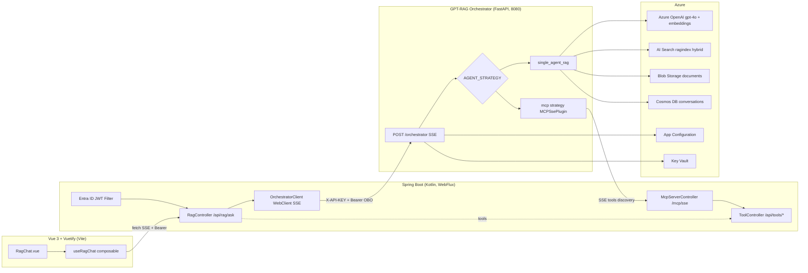

# GPT-RAG Orchestrator — Plan de Integración con Vue 3 + Spring Boot

> **Stack objetivo:** Vue 3 + Vuetify + Vite (TypeScript) · Kotlin + Spring Boot · Azure
> **Objetivo:** Embeber el orchestrator en una webapp propia y evolucionar hacia ejecución agentic.

---

## 0. TL;DR

El GPT-RAG Orchestrator es una app **Python 3.12 + FastAPI** desplegada en Azure Container Apps, con un único endpoint `POST /orchestrator` que devuelve **SSE**. Internamente usa Azure AI Foundry Agent Service v2, AI Search (híbrida), Cosmos DB (conversaciones) y Blob Storage (documentos/prompts).

**Sí se puede embeber**, pero **NO consumirlo directo desde Vue**. Lo correcto es un **proxy en Spring Boot** que:
- Valida el JWT de Entra ID del usuario.
- Normaliza el stream SSE de texto plano a JSON estructurado.
- Expone una API limpia a Vue.
- Actúa como MCP server / backend de tools para la parte agentic.

---

## 1. Arquitectura



---

## 2. Análisis del orchestrator actual

### 2.1 Entry point y deployment
- **Framework:** FastAPI + Uvicorn (Python 3.12), puerto 8080.
- **Entry point:** `src/main.py`.
- **Deployment:** Docker → Azure Container Apps vía `azd`.
- **Config:** Azure App Configuration (primario) + env vars (fallback).

### 2.2 Endpoint expuesto
**`POST /orchestrator`** — único endpoint funcional, definido en `src/main.py:257-515`.

- **Content-Type respuesta:** `text/event-stream` (SSE).
- **OpenAPI:** disponible en `/docs` y `/openapi.json`.
- **Streaming:** sí, chunks de texto crudo con citas en Markdown inline `[title](url)`.

### 2.3 Autenticación (dos capas)

**API-level** (`src/dependencies.py:162-227`):
- Header `dapr-api-token` o `X-API-KEY`.
- Validado contra env vars `APP_API_TOKEN`, `DAPR_API_TOKEN` o `dev-token` (hardcoded).
- Se salta con `DISABLE_AUTH=true`.

**User-level** (`src/dependencies.py:301-688`):
- `Authorization: Bearer <entra-id-jwt>`.
- Validación JWT con JWKS de Azure AD (v1/v2), cacheado.
- Extrae `oid`, `preferred_username`, `name`.
- Opcional: enrichment con Graph API si hay `OAUTH_AZURE_AD_CLIENT_SECRET`.
- Allow-list vía `ALLOWED_USER_NAMES` / `ALLOWED_USER_PRINCIPALS`.

### 2.4 Flujo de datos (query → respuesta)

1. Request entra al **orchestrator (FastAPI)** con `ask`, `conversation_id` opcional, y `user_context` (este último lo construye Spring desde el JWT autenticado en el paso 0; ver §3.1: el browser nunca lo envía).
2. Factory selecciona strategy según `AGENT_STRATEGY` (default: `single_agent_rag`).
3. **Embeddings:** modelo `EMBEDDING_DEPLOYMENT_NAME` (ej. `text-embedding-3-large`, 3072 dims).
4. **Retrieval (AI Search):** índice `SEARCH_RAG_INDEX_NAME`, approach `hybrid|vector|term`, top-K configurable, semantic ranking opcional.
5. **Generación:** Azure AI Foundry Agent Service v2 con tools (`search_knowledge_base`, opcional `bing_grounding`). Si el índice está vacío, hace bypass a Azure OpenAI directo (optimización de latencia).
6. **Citas:** convierte placeholders tipo `【3:0†source】` a Markdown `[title](url)`.
7. **Persistencia:** conversación en Cosmos DB (async upsert post-stream).
8. **Response:** SSE chunk a chunk vía `StreamingResponse`.

### 2.5 Strategies disponibles
- `single_agent_rag` (default) — Azure AI Foundry Agent Service v2.
- `maf_agent_service` — Microsoft Agent Framework + Agent Service.
- `maf_lite` — MAF directo contra Azure OpenAI.
- `mcp` — Model Context Protocol vía Semantic Kernel (ya implementado).
- `nl2sql` — multi-agent group chat para SQL.
- `multimodal` — vision + text RAG.

### 2.6 Clients reutilizables (singletons)
- `IdentityManager` — credenciales AAD centralizadas.
- `GenAIModelClient` — embeddings + chat.
- `SearchClient` — hybrid search con OBO.
- `CosmosDBClient` — conversaciones.
- `AppConfigClient` — config centralizada.

---

## 3. Contratos API

### 3.1 Frontend → Spring Boot

**`POST /api/rag/ask`**

Headers:
```
Authorization: Bearer <entra-id-token>
Accept: text/event-stream
Content-Type: application/json
```

Request:
```json
{
  "ask": "¿Cuál es la política de devoluciones?",
  "conversationId": "uuid-opcional"
}
```

**Auth-boundary note.** `UserContext` (forwarded to the orchestrator on the OBO leg) is **server-derived** from the authenticated Entra ID JWT — `oid`, `preferred_username`, and any configured attribute mapping (e.g., `department` from a Graph enrichment step). The browser MUST NOT include a `userContext` field; Spring builds it via `UserContextBuilder` from the JWT in `ReactiveSecurityContextHolder`. Accepting client-supplied identity here would let the front-end override the OBO subject and forward an attacker-chosen `oid` downstream.

Response SSE (JSON envelope normalizado por Spring):

Examples: see [.junie/contracts/sse-events.examples.json](.junie/contracts/sse-events.examples.json) — each entry is a single SSE `data:` payload; the contract test (per `.junie/playbooks/04-contract-tests.md`) validates every example against the canonical schema at [.junie/contracts/sse-events.schema.json](.junie/contracts/sse-events.schema.json).

The 5 event types are: `conversationId` (emitted at most once, before first chunk), `chunk` (zero or more streaming text fragments), `citation` (zero or more citations interleaved with chunks), `done` (terminator on success), `error` (terminator on failure, replaces `done`).

Do not restate event payloads inline in this file — the canonical schema and the sidecar fixture are the source of truth (R5/R10).

### 3.2 Spring Boot → Orchestrator

**`POST {ORCHESTRATOR_URL}/orchestrator`**

Headers:
```
X-API-KEY: <APP_API_TOKEN>
Authorization: Bearer <user-token>   # passthrough para OBO
Accept: text/event-stream
```

Request:
```json
{
  "ask": "...",
  "conversation_id": "c-123",
  "user_context": {
    "oid": "...",
    "upn": "...",
    "department": "ventas"
  }
}
```

Response: SSE texto plano con citas Markdown inline.

### 3.3 Tool endpoints (para agentic)

**`POST /api/tools/{toolName}`** — invocado por el orchestrator.

Ejemplo (`createTicket`):
```json
// Request
{ "title": "...", "priority": "high", "userOid": "..." }

// Response
{ "ticketId": "T-456", "status": "created" }
```

---

## 4. Estructura de proyectos

### 4.1 Backend (Kotlin + Spring Boot)

```
backend/
├── build.gradle.kts
├── src/main/kotlin/com/tuapp/rag/
│   ├── RagApplication.kt
│   ├── config/
│   │   ├── SecurityConfig.kt           # JWT resource server + CORS
│   │   ├── WebClientConfig.kt          # WebClient con timeouts SSE
│   │   └── OrchestratorProperties.kt   # @ConfigurationProperties
│   ├── web/
│   │   ├── RagController.kt            # POST /api/rag/ask (SSE)
│   │   ├── ToolController.kt           # endpoints invocables como tools
│   │   └── dto/
│   │       ├── AskRequest.kt
│   │       ├── AskChunk.kt             # sealed class: Chunk|Citation|Done|Error
│   │       └── Citation.kt
│   ├── service/
│   │   ├── OrchestratorClient.kt       # WebClient reactivo
│   │   ├── SseEnvelopeMapper.kt        # texto crudo → JSON events
│   │   ├── UserContextBuilder.kt       # JWT claims → user_context
│   │   └── ConversationService.kt      # cache/auditoría opcional
│   ├── tools/
│   │   ├── ToolRegistry.kt             # registro en memoria
│   │   ├── ToolDefinition.kt           # schema JSON (name, desc, params)
│   │   └── impl/                       # CreateTicketTool, ...
│   └── mcp/                            # fase 4
│       ├── McpServer.kt                # SSE transport
│       ├── McpMessageHandler.kt
│       └── McpToolAdapter.kt
└── src/main/resources/application.yml
```

### 4.2 Frontend (Vue 3 + Vuetify + Vite)

```
frontend/
├── package.json
├── vite.config.ts
└── src/
    ├── components/rag/
    │   ├── RagChat.vue                 # componente embebible
    │   ├── RagMessage.vue              # burbuja markdown + citas
    │   ├── RagCitation.vue             # chip con doc/link
    │   └── RagInput.vue
    ├── composables/
    │   ├── useRagChat.ts               # estado + streaming
    │   └── useSseClient.ts             # fetchEventSource wrapper
    ├── services/
    │   └── ragApi.ts                   # wrapper HTTP
    ├── types/
    │   └── rag.ts
    └── plugins/
        └── markdown.ts                 # marked + highlight.js + DOMPurify
```

---

## 5. Dependencias

### 5.1 `build.gradle.kts`

```kotlin
dependencies {
    implementation("org.springframework.boot:spring-boot-starter-webflux")
    implementation("org.springframework.boot:spring-boot-starter-security")
    implementation("org.springframework.boot:spring-boot-starter-oauth2-resource-server")
    implementation("org.springframework.boot:spring-boot-starter-actuator")
    implementation("org.springframework.boot:spring-boot-starter-validation")
    implementation("com.fasterxml.jackson.module:jackson-module-kotlin")
    implementation("io.projectreactor.kotlin:reactor-kotlin-extensions")
    implementation("org.jetbrains.kotlinx:kotlinx-coroutines-reactor")
    implementation("io.github.resilience4j:resilience4j-spring-boot3:2.2.0")
    // Azure
    implementation("com.azure:azure-identity:1.13.0")
    // MCP (fase 4, opcional)
    implementation("io.modelcontextprotocol.sdk:mcp:0.8.0")
    implementation("io.modelcontextprotocol.sdk:mcp-spring-webflux:0.8.0")

    testImplementation("org.springframework.boot:spring-boot-starter-test")
    testImplementation("io.projectreactor:reactor-test")
}
```

### 5.2 `package.json`

```json
{
  "dependencies": {
    "vue": "^3.5.0",
    "vuetify": "^3.7.0",
    "@mdi/font": "^7.4.0",
    "marked": "^14.1.0",
    "highlight.js": "^11.10.0",
    "dompurify": "^3.1.6",
    "@microsoft/fetch-event-source": "^2.0.1",
    "pinia": "^2.2.0"
  },
  "devDependencies": {
    "vite": "^5.4.0",
    "vite-plugin-vuetify": "^2.0.4",
    "typescript": "^5.6.0",
    "vue-tsc": "^2.1.0"
  }
}
```

> **Nota:** `@microsoft/fetch-event-source` es imprescindible — el `EventSource` nativo no soporta headers custom y vas a necesitar `Authorization: Bearer`.

---

## 6. Direct Tool Calling vs MCP Server

| Criterio | Tool Calling HTTP directo | MCP Server en Spring Boot |
|---|---|---|
| **Esfuerzo inicial** | Bajo: REST endpoints + registro JSON | Medio-alto: protocolo MCP (SSE + JSON-RPC) |
| **Acoplamiento** | Tools hardcodeadas en prompts/strategy | Descubrimiento dinámico vía `list_tools` |
| **Strategy del orchestrator** | `single_agent_rag` con function tools custom (requiere modificar Python) | `mcp` strategy ya existe — solo config `MCP_APP_ENDPOINT` |
| **Estándar** | Propietario | Estándar abierto (Anthropic/Microsoft) |
| **Multi-cliente** | Solo el orchestrator | Reutilizable desde Claude Desktop, Copilot, otros agentes |
| **Auth de tools** | Spring Security normal | Headers custom con identidad (patrón de `mcp_strategy.py`) |
| **Streaming tool responses** | Nativo Spring | Soportado vía SSE transport |
| **SDK JVM** | N/A (REST) | `io.modelcontextprotocol.sdk:mcp-spring-webflux` |
| **Recomendación** | ✅ **Fase 1-3** | ✅ **Fase 4** (3+ tools o reutilización) |

**Veredicto:** empezar con tool calling HTTP directo registrando tools en `single_agent_rag_strategy_v2.py`. Migrar a MCP cuando el catálogo crezca o quieras reutilizar tools desde otros agentes.

---

## 7. Gaps y bloqueantes en el orchestrator actual

| # | Gap | Impacto | Mitigación |
|---|---|---|---|
| 1 | Sin CORS middleware en FastAPI | Vue no puede llamar directo | Proxy Spring (recomendado) o añadir `CORSMiddleware` |
| 2 | SSE sin JSON envelope — texto crudo con `[title](url)` inline | Parsing frágil en Vue | Normalizar en el proxy |
| 3 | Error handling inconsistente (`event: error` vs 500) | Difícil manejar en Vue | Normalizar en el proxy |
| 4 | Sin cancelación server-side | Coste innecesario en Azure OpenAI si el cliente aborta | Timeouts agresivos en WebClient |
| 5 | No hay agentic loop real (single-shot retrieval+gen con function tools del SDK) | Para tools custom hay que extender la strategy | Registrar function tools o usar `mcp` strategy |
| 6 | Auth API-level con tokens hardcoded | OK tras proxy, mal si se expone | **Nunca exponer el orchestrator a internet** |
| 7 | Sin rate limiting | Riesgo de coste en Azure OpenAI | Bucket por `oid` en Spring |
| 8 | OBO flow requiere app registration con permisos delegados | Config extra en Entra ID | Configurar "On-Behalf-Of" explícitamente |
| 9 | Prompts en archivos — sin hot reload | Cambios requieren redeploy | `PROMPT_SOURCE=cosmos` |
| 10 | Citas en Markdown inline mezcladas con texto | Difícil separar UI | Regex extraction en el proxy |

---

## 8. Secuencia de implementación

### Fase 1 — MVP embebido (1-2 semanas)
1. Crear app registrations en Entra ID:
   - SPA (Vue) con redirect URIs.
   - API (Spring Boot) que expone scopes.
   - Configurar flujo **On-Behalf-Of** para que Spring pueda pasar el token al orchestrator.
2. Scaffold Spring Boot con `OrchestratorClient` (WebClient reactivo, `MediaType.TEXT_EVENT_STREAM`).
3. Implementar `RagController` que proxya SSE, normalizando a JSON events (`chunk`, `citation`, `done`, `error`).
4. Extraer citas inline `[title](url)` con regex en `SseEnvelopeMapper`.
5. Crear `RagChat.vue` + `useRagChat` usando `@microsoft/fetch-event-source`, render Markdown con `marked` + `DOMPurify` + `highlight.js`.
6. Validar en browser real: happy path, errores 401, timeout, desconexión, cancelación.

### Fase 2 — Hardening (1 semana)
7. Rate limiting por `oid` (Bucket4j o Resilience4j).
8. Logging estructurado + métricas (Actuator + App Insights exporter).
9. Cancelación end-to-end: `AbortController` en Vue → cierre del subscription reactivo en Spring.
10. Cache opcional de respuestas idénticas (Caffeine, TTL corto).
11. Circuit breaker hacia el orchestrator (Resilience4j).

### Fase 3 — Agentic con HTTP tools (2 semanas)
12. Implementar `ToolController` con 1-2 tools reales del dominio (ej. `createTicket`, `getOrderStatus`).
13. Definir `ToolDefinition` con schema JSON (nombre, descripción, parámetros).
14. Fork/PR al orchestrator: registrar esas tools como function tools en `single_agent_rag_strategy_v2.py`, apuntando a Spring Boot.
15. Auth entre orchestrator y Spring: shared secret en header o mTLS.
16. Test end-to-end: el agente decide llamar la tool, Spring ejecuta, el agente sintetiza respuesta final.

### Fase 4 — Migración a MCP (opcional, 1-2 semanas)
17. Levantar MCP server en Spring con `mcp-spring-webflux`, exponiendo las mismas tools.
18. Configurar `MCP_APP_ENDPOINT` apuntando a Spring y `AGENT_STRATEGY=mcp` en App Configuration.
19. El orchestrator descubre tools dinámicamente — añadir tools nuevas ya no requiere tocar código Python.
20. Propagar identidad del usuario a MCP server vía headers custom (patrón existente en `mcp_strategy.py`).

---

## 9. Decisiones clave

- **Proxy obligatorio:** no exponer el orchestrator directamente a Vue. Spring Boot es el único punto de entrada autorizado.
- **WebFlux sobre MVC:** SSE end-to-end requiere streaming reactivo; `RestTemplate` no sirve.
- **Token passthrough:** el JWT del usuario se propaga al orchestrator para que haga OBO hacia AI Search con la identidad del usuario (permite filtros de seguridad por documento).
- **JSON envelope en proxy:** invertir en normalizar el SSE ahora ahorra dolor en el frontend más adelante.
- **MCP diferido:** no sobre-ingeniar la fase 1. Tool calling HTTP cubre el 80% de casos con 20% del esfuerzo.

---

## 10. Referencias del código analizado

- Entry point: `src/main.py:257-515`
- Auth API-level: `src/dependencies.py:162-227`
- Auth user-level: `src/dependencies.py:301-688`
- SSE generator: `src/main.py:503-515`
- Factory de strategies: `src/strategies/agent_strategy_factory.py`
- Strategy default: `src/strategies/single_agent_rag_strategy_v2.py`
- Strategy MCP: `src/strategies/mcp_strategy.py`
- Search client: `src/connectors/search.py`
- GenAI client: `src/connectors/aifoundry.py`
- Config loader: `src/connectors/appconfig.py`
- Citations: `src/util/citations.py`
- Prompt default: `src/prompts/single_agent_rag/main.jinja2`
- Sample env: `.env.sample`
