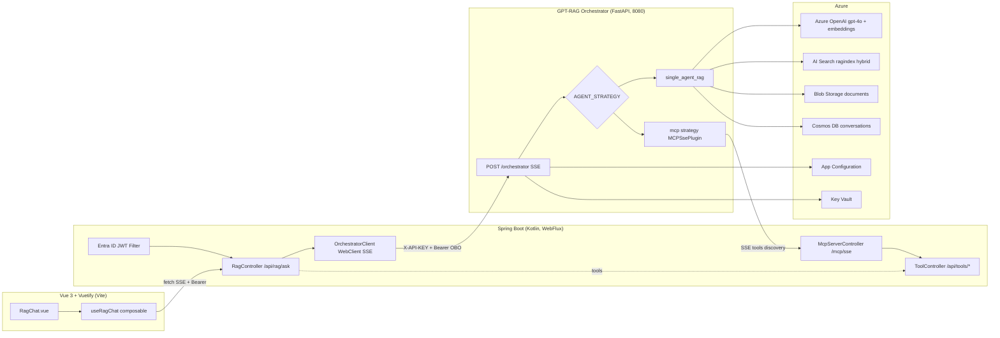

# GPT-RAG Orchestrator — Integration Plan with Vue 3 + Spring Boot

> **Target stack:** Vue 3 + Vuetify + Vite · Kotlin + Spring Boot · Azure
> **Frontend language:** JavaScript by default (aligned with `.junie/guidelines.md` and the team's current baseline). TypeScript is the opt-in variant in `01-preflight`; the `.ts` snippets in §4 below are the TS-equivalent shape and must be read as `.js` when the default is kept.
> **Goal:** Embed the orchestrator inside an in-house web app and evolve toward agentic execution.

---

## 0. TL;DR

The GPT-RAG Orchestrator is a **Python 3.12 + FastAPI** app deployed on Azure Container Apps with a single endpoint `POST /orchestrator` that returns **SSE**. Internally it uses Azure AI Foundry Agent Service v2, AI Search (hybrid), Cosmos DB (conversations) and Blob Storage (documents/prompts).

**Embedding it is supported**, but **NOT by consuming it directly from Vue**. The right shape is a **Spring Boot proxy** that:
- Validates the user's Entra ID JWT.
- Normalises the plain-text SSE stream into structured JSON events.
- Exposes a clean API to Vue.
- Acts as MCP server / tool backend for the agentic side.

---

## 1. Architecture



---

## 2. Analysis of the current orchestrator

### 2.1 Entry point and deployment
- **Framework:** FastAPI + Uvicorn (Python 3.12), port 8080.
- **Entry point:** `src/main.py`.
- **Deployment:** Docker → Azure Container Apps via `azd`.
- **Config:** Azure App Configuration (primary) + env vars (fallback).

### 2.2 Exposed endpoint
**`POST /orchestrator`** — the only functional endpoint, defined at `src/main.py:257-515`.

- **Response Content-Type:** `text/event-stream` (SSE).
- **OpenAPI:** available at `/docs` and `/openapi.json`.
- **Streaming:** yes — raw text chunks with citations as inline Markdown `[title](url)`.

### 2.3 Authentication (two layers)

**API-level** (`src/dependencies.py:162-227`):
- `dapr-api-token` or `X-API-KEY` header.
- Validated against env vars `APP_API_TOKEN`, `DAPR_API_TOKEN`, or the hardcoded `dev-token`.
- Bypassed when `DISABLE_AUTH=true`.

**User-level** (`src/dependencies.py:301-688`):
- `Authorization: Bearer <entra-id-jwt>`.
- JWT validation against the cached Azure AD JWKS (v1/v2).
- Extracts `oid`, `preferred_username`, `name`.
- Optional Graph API enrichment when `OAUTH_AZURE_AD_CLIENT_SECRET` is set.
- Allow-list via `ALLOWED_USER_NAMES` / `ALLOWED_USER_PRINCIPALS`.

### 2.4 Data flow (query → response)

1. Request arrives at the **orchestrator (FastAPI)** with `ask`, optional `conversation_id`, and `user_context` (Spring builds the last one from the authenticated JWT in step 0; see §3.1: the browser never sends it).
2. Factory selects a strategy from `AGENT_STRATEGY` (default: `single_agent_rag`).
3. **Embeddings:** model `EMBEDDING_DEPLOYMENT_NAME` (e.g. `text-embedding-3-large`, 3072 dims).
4. **Retrieval (AI Search):** index `SEARCH_RAG_INDEX_NAME`, approach `hybrid|vector|term`, configurable top-K, optional semantic ranking.
5. **Generation:** Azure AI Foundry Agent Service v2 with tools (`search_knowledge_base`, optional `bing_grounding`). When the index is empty it bypasses to direct Azure OpenAI calls (latency optimisation).
6. **Citations:** placeholders like `【3:0†source】` are converted to Markdown `[title](url)`.
7. **Persistence:** conversation upsert to Cosmos DB (async, after the stream).
8. **Response:** SSE chunk-by-chunk via `StreamingResponse`.

### 2.5 Available strategies
- `single_agent_rag` (default) — Azure AI Foundry Agent Service v2.
- `maf_agent_service` — Microsoft Agent Framework + Agent Service.
- `maf_lite` — MAF directly against Azure OpenAI.
- `mcp` — Model Context Protocol via Semantic Kernel (already implemented).
- `nl2sql` — multi-agent group chat for SQL.
- `multimodal` — vision + text RAG.

### 2.6 Reusable clients (singletons)
- `IdentityManager` — centralised AAD credentials.
- `GenAIModelClient` — embeddings + chat.
- `SearchClient` — hybrid search with OBO.
- `CosmosDBClient` — conversations.
- `AppConfigClient` — centralised config.

---

## 3. API contracts

### 3.1 Frontend → Spring Boot

**`POST /api/rag/ask`**

Headers:
```
Authorization: Bearer <entra-id-token>
Accept: text/event-stream
Content-Type: application/json
```

Request:
```json
{
  "ask": "What is the refund policy?",
  "conversationId": "uuid-optional"
}
```

**Auth-boundary note.** `UserContext` (forwarded to the orchestrator on the OBO leg) is **server-derived** from the authenticated Entra ID JWT — `oid`, `preferred_username`, and any configured attribute mapping (e.g., `department` from a Graph enrichment step). The browser MUST NOT include a `userContext` field; Spring builds it via `UserContextBuilder` from the JWT in `ReactiveSecurityContextHolder`. Accepting client-supplied identity here would let the front-end override the OBO subject and forward an attacker-chosen `oid` downstream.

Response SSE (JSON envelope normalised by Spring):

Examples: see [.junie/contracts/sse-events.examples.json](.junie/contracts/sse-events.examples.json) — each entry is a single SSE `data:` payload; the contract test (per `.junie/playbooks/04-contract-tests.md`) validates every example against the canonical schema at [.junie/contracts/sse-events.schema.json](.junie/contracts/sse-events.schema.json).

The 5 event types are: `conversationId` (emitted at most once, before the first chunk), `chunk` (zero or more streaming text fragments), `citation` (zero or more citations interleaved with chunks), `done` (terminator on success), `error` (terminator on failure, replaces `done`).

Do not restate event payloads inline in this file — the canonical schema and the sidecar fixture are the source of truth (R5/R10).

### 3.2 Spring Boot → Orchestrator

**`POST {ORCHESTRATOR_URL}/orchestrator`**

Headers:
```
X-API-KEY: <APP_API_TOKEN>
Authorization: Bearer <user-token>   # passthrough for OBO
Accept: text/event-stream
```

Request:
```json
{
  "ask": "...",
  "conversation_id": "c-123",
  "user_context": {
    "oid": "...",
    "upn": "...",
    "department": "sales"
  }
}
```

Response: plain-text SSE with inline Markdown citations.

### 3.3 Tool endpoints (for agentic mode)

**`POST /api/tools/{toolName}`** — invoked by the orchestrator.

Example (`createTicket`):
```json
// Request
{ "title": "...", "priority": "high", "userOid": "..." }

// Response
{ "ticketId": "T-456", "status": "created" }
```

---

## 4. Project structure

### 4.1 Backend (Kotlin + Spring Boot)

```
backend/
├── build.gradle.kts
├── src/main/kotlin/com/example/rag/
│   ├── RagApplication.kt
│   ├── config/
│   │   ├── SecurityConfig.kt           # JWT resource server + CORS
│   │   ├── WebClientConfig.kt          # WebClient with SSE timeouts
│   │   └── OrchestratorProperties.kt   # @ConfigurationProperties
│   ├── web/
│   │   ├── RagController.kt            # POST /api/rag/ask (SSE)
│   │   ├── ToolController.kt           # endpoints invokable as tools
│   │   └── dto/
│   │       ├── AskRequest.kt
│   │       ├── AskChunk.kt             # sealed class: Chunk|Citation|Done|Error
│   │       └── Citation.kt
│   ├── service/
│   │   ├── OrchestratorClient.kt       # reactive WebClient
│   │   ├── SseEnvelopeMapper.kt        # raw text → JSON events
│   │   ├── UserContextBuilder.kt       # JWT claims → user_context
│   │   └── ConversationService.kt      # optional cache/audit
│   ├── tools/
│   │   ├── ToolRegistry.kt             # in-memory registry
│   │   ├── ToolDefinition.kt           # JSON schema (name, desc, params)
│   │   └── impl/                       # CreateTicketTool, ...
│   └── mcp/                            # phase 4
│       ├── McpServer.kt                # SSE transport
│       ├── McpMessageHandler.kt
│       └── McpToolAdapter.kt
└── src/main/resources/application.yml
```

### 4.2 Frontend (Vue 3 + Vuetify + Vite)

> The tree below shows the **TypeScript** variant (opt-in). For the JavaScript default, replace `.ts` with `.js` and drop `src/types/rag.ts`. The structure, folder names, and file matrix are identical between variants — only the extension and the presence of types change.

```
frontend/
├── package.json
├── vite.config.{js,ts}                  # .js by default; .ts when TypeScript is opted in
└── src/
    ├── components/rag/
    │   ├── RagChat.vue                 # embeddable component
    │   ├── RagMessage.vue              # markdown bubble + citations
    │   ├── RagCitation.vue             # doc/link chip
    │   └── RagInput.vue
    ├── composables/
    │   ├── useRagChat.{js,ts}          # state + streaming
    │   └── useSseClient.{js,ts}        # fetchEventSource wrapper
    ├── services/
    │   ├── auth.{js,ts}                # adapter — delegates to msalConfig.js
    │   ├── auth-stub.{js,ts}           # dev-only stub (resolved by Vite alias)
    │   └── ragApi.{js,ts}              # HTTP wrapper
    ├── auth/
    │   └── msalConfig.{js,ts}          # MSAL hardened (R11) — single source of getToken
    ├── types/
    │   └── rag.ts                      # only in the TypeScript variant
    └── plugins/
        └── markdown.{js,ts}            # marked + highlight.js + DOMPurify
```

---

## 5. Dependencies

### 5.1 `build.gradle.kts`

```kotlin
dependencies {
    implementation("org.springframework.boot:spring-boot-starter-webflux")
    implementation("org.springframework.boot:spring-boot-starter-security")
    implementation("org.springframework.boot:spring-boot-starter-oauth2-resource-server")
    implementation("org.springframework.boot:spring-boot-starter-actuator")
    implementation("org.springframework.boot:spring-boot-starter-validation")
    implementation("com.fasterxml.jackson.module:jackson-module-kotlin")
    implementation("io.projectreactor.kotlin:reactor-kotlin-extensions")
    implementation("org.jetbrains.kotlinx:kotlinx-coroutines-reactor")
    implementation("io.github.resilience4j:resilience4j-spring-boot3:2.2.0")
    // Azure
    implementation("com.azure:azure-identity:1.13.0")
    // MCP (phase 4, optional)
    implementation("io.modelcontextprotocol.sdk:mcp:0.8.0")
    implementation("io.modelcontextprotocol.sdk:mcp-spring-webflux:0.8.0")

    testImplementation("org.springframework.boot:spring-boot-starter-test")
    testImplementation("io.projectreactor:reactor-test")
}
```

### 5.2 `package.json`

```json
{
  "dependencies": {
    "vue": "^3.5.0",
    "vuetify": "^3.7.0",
    "@mdi/font": "^7.4.0",
    "marked": "^14.1.0",
    "highlight.js": "^11.10.0",
    "dompurify": "^3.1.6",
    "@microsoft/fetch-event-source": "^2.0.1",
    "@azure/msal-browser": "^3.20.0",
    "pinia": "^2.2.0"
  },
  "devDependencies": {
    "vite": "^5.4.0",
    "@vitejs/plugin-vue": "^5.1.0",
    "vite-plugin-vuetify": "^2.0.4",
    "vitest": "^2.0.0",
    "ajv": "^8.17.0",
    "ajv-formats": "^3.0.1"
  },
  "engines": {
    "node": ">=20.0.0"
  }
}
```

> **TypeScript variant only** (opt-in in `01-preflight`): also add `"typescript": "^5.6.0"` and `"vue-tsc": "^2.1.0"` to `devDependencies`. The JavaScript default does not need them — `.spec.js` files and `.js` snippets do not require the TS toolchain.

> **Notes:**
> - `@microsoft/fetch-event-source` is required — the native `EventSource` does not support custom headers, and `Authorization: Bearer` is needed.
> - `@azure/msal-browser` is imported by `src/auth/msalConfig.{js,ts}` (R11/SC6 hardened MSAL). Without it the build fails with `Cannot find module '@azure/msal-browser'`.
> - `@vitejs/plugin-vue` is imported by `vite.config.js` (`plugins: [vue()]`); without it the dev server starts but no `.vue` file compiles.
> - `vitest` + `ajv` + `ajv-formats` are the runners and validators that `contract-tests/contract.spec.{js,ts}` and `contract-tests/leak.spec.{js,ts}` require (playbook 04 Steps 2 and 5).
> - `engines.node >= 20` is the declared floor, aligned with Vite 5 (Node ≥18 since 5.0, Node 20 LTS preferred) and Vitest 2. The playbook 04 specs are Node-18-safe (the leak test uses a manual `withFileTypes` walker), but declaring the floor prevents ambiguity if a future spec relies on a Node-20-only API.

---

## 6. Direct Tool Calling vs MCP Server

| Criterion | Direct HTTP tool calling | MCP Server in Spring Boot |
|---|---|---|
| **Initial effort** | Low: REST endpoints + JSON registry | Medium-high: MCP protocol (SSE + JSON-RPC) |
| **Coupling** | Tools hardcoded into prompts/strategy | Dynamic discovery via `list_tools` |
| **Orchestrator strategy** | `single_agent_rag` with custom function tools (requires modifying Python) | The `mcp` strategy already exists — only `MCP_APP_ENDPOINT` config is needed |
| **Standard** | Proprietary | Open standard (Anthropic/Microsoft) |
| **Multi-client** | Orchestrator only | Reusable from Claude Desktop, Copilot, other agents |
| **Tool auth** | Standard Spring Security | Custom identity headers (pattern from `mcp_strategy.py`) |
| **Streaming tool responses** | Native in Spring | Supported via SSE transport |
| **JVM SDK** | N/A (REST) | `io.modelcontextprotocol.sdk:mcp-spring-webflux` |
| **Recommendation** | ✅ **Phases 1–3** | ✅ **Phase 4** (3+ tools or cross-agent reuse) |

**Verdict:** start with direct HTTP tool calling, registering tools in `single_agent_rag_strategy_v2.py`. Migrate to MCP when the catalogue grows or you need to reuse tools from other agents.

---

## 7. Gaps and blockers in the current orchestrator

| # | Gap | Impact | Mitigation |
|---|---|---|---|
| 1 | No CORS middleware in FastAPI | Vue cannot call directly | Spring proxy (recommended) or add `CORSMiddleware` |
| 2 | SSE without JSON envelope — raw text with inline `[title](url)` | Fragile parsing in Vue | Normalise in the proxy |
| 3 | Inconsistent error handling (`event: error` vs HTTP 500) | Hard to handle in Vue | Normalise in the proxy |
| 4 | No server-side cancellation | Wasted spend on Azure OpenAI when the client aborts | Aggressive timeouts in WebClient |
| 5 | No real agentic loop (single-shot retrieval+generation with SDK function tools) | Custom tools require extending the strategy | Register function tools or use the `mcp` strategy |
| 6 | API-level auth uses hardcoded tokens | Acceptable behind a proxy, unsafe if exposed | **Never expose the orchestrator to the internet** |
| 7 | No rate limiting | Cost risk on Azure OpenAI | Per-`oid` token bucket in Spring |
| 8 | OBO flow needs an app registration with delegated permissions | Extra Entra ID configuration | Configure "On-Behalf-Of" explicitly |
| 9 | Prompts in files — no hot reload | Changes require redeploy | `PROMPT_SOURCE=cosmos` |
| 10 | Citations as inline Markdown mixed with text | Hard to separate in the UI | Regex extraction in the proxy |

---

## 8. Implementation sequence

### Phase 1 — Embedded MVP (1-2 weeks)
1. Create app registrations in Entra ID:
   - SPA (Vue) with redirect URIs.
   - API (Spring Boot) exposing scopes.
   - Configure the **On-Behalf-Of** flow so Spring can pass the user token to the orchestrator.
2. Scaffold Spring Boot with `OrchestratorClient` (reactive WebClient, `MediaType.TEXT_EVENT_STREAM`).
3. Implement `RagController` to proxy SSE, normalising it into JSON events (`chunk`, `citation`, `done`, `error`).
4. Extract inline citations `[title](url)` with a regex in `SseEnvelopeMapper`.
5. Build `RagChat.vue` + `useRagChat` using `@microsoft/fetch-event-source`, render Markdown with `marked` + `DOMPurify` + `highlight.js`.
6. Validate end-to-end in a real browser: happy path, 401 errors, timeout, disconnect, cancellation.

### Phase 2 — Hardening (1 week)
7. Per-`oid` rate limiting (Bucket4j or Resilience4j).
8. Structured logging + metrics (Actuator + App Insights exporter).
9. End-to-end cancellation: `AbortController` in Vue → cancel the reactive subscription in Spring.
10. Optional cache for identical responses (Caffeine, short TTL).
11. Circuit breaker towards the orchestrator (Resilience4j).

### Phase 3 — Agentic mode with HTTP tools (2 weeks)
12. Implement `ToolController` with one or two real domain tools (e.g. `createTicket`, `getOrderStatus`).
13. Define `ToolDefinition` with a JSON schema (name, description, parameters).
14. Fork/PR the orchestrator: register those tools as function tools in `single_agent_rag_strategy_v2.py`, pointing at Spring Boot.
15. Auth between the orchestrator and Spring: shared secret in a header or mTLS.
16. End-to-end test: the agent decides to call the tool, Spring runs it, the agent synthesises the final answer.

### Phase 4 — MCP migration (optional, 1-2 weeks)
17. Stand up an MCP server in Spring with `mcp-spring-webflux`, exposing the same tools.
18. Set `MCP_APP_ENDPOINT` to the Spring server and `AGENT_STRATEGY=mcp` in App Configuration.
19. The orchestrator now discovers tools dynamically — adding new tools no longer requires touching Python code.
20. Propagate the user identity into the MCP server via custom headers (existing pattern in `mcp_strategy.py`).

---

## 9. Key decisions

- **Proxy is mandatory:** never expose the orchestrator directly to Vue. Spring Boot is the only authorised entry point.
- **WebFlux over MVC:** end-to-end SSE requires reactive streaming; `RestTemplate` does not work.
- **Token passthrough:** the user JWT is forwarded to the orchestrator so it can OBO into AI Search with the user's identity (enables per-document security filters).
- **JSON envelope in the proxy:** investing in normalising SSE now prevents frontend pain later.
- **MCP deferred:** no over-engineering in phase 1. HTTP tool calling covers 80% of cases with 20% of the effort.

---

## 10. References to the analysed code

- Entry point: `src/main.py:257-515`
- API-level auth: `src/dependencies.py:162-227`
- User-level auth: `src/dependencies.py:301-688`
- SSE generator: `src/main.py:503-515`
- Strategy factory: `src/strategies/agent_strategy_factory.py`
- Default strategy: `src/strategies/single_agent_rag_strategy_v2.py`
- MCP strategy: `src/strategies/mcp_strategy.py`
- Search client: `src/connectors/search.py`
- GenAI client: `src/connectors/aifoundry.py`
- Config loader: `src/connectors/appconfig.py`
- Citations: `src/util/citations.py`
- Default prompt: `src/prompts/single_agent_rag/main.jinja2`
